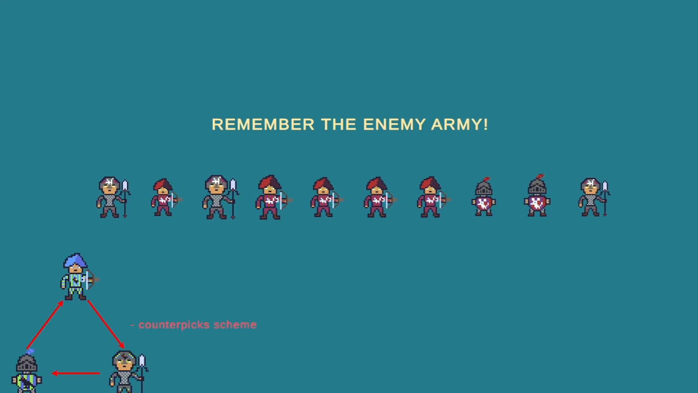
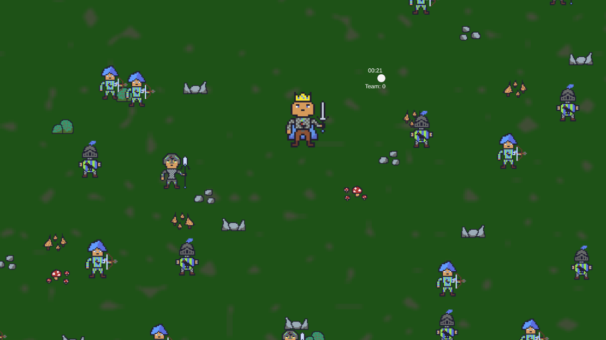
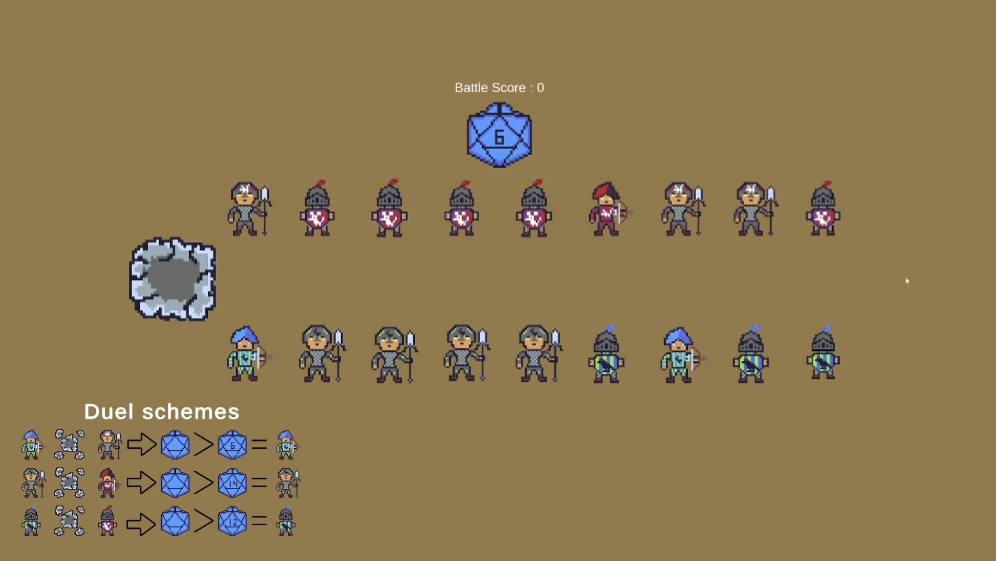
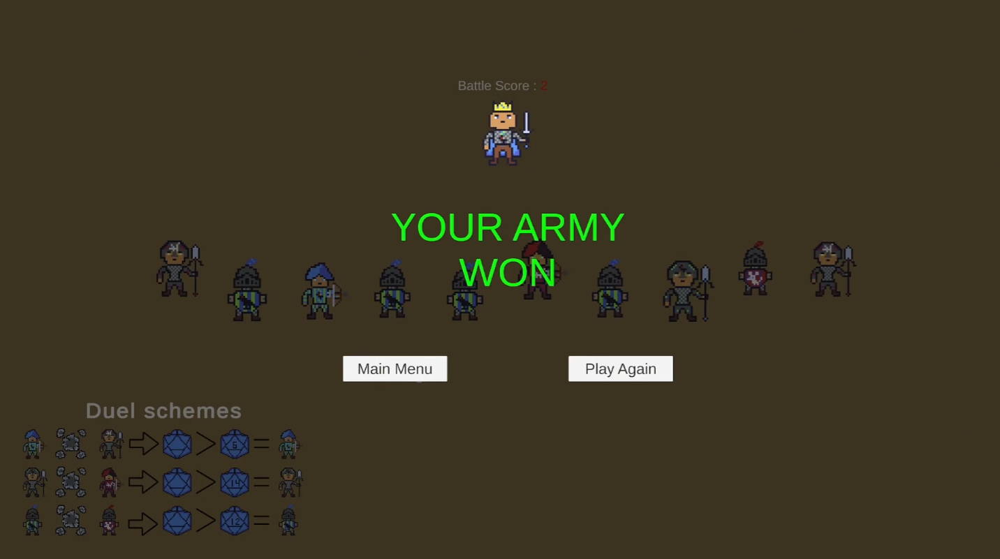

# Last Try
## An eye-tracking arcade strategy game where you build and command your army using only your gaze.

---

## About the Game

**Last Try** is an arcade strategy prototype built around Tobii eye-tracking technology.

The player takes the role of a king who must recruit soldiers by looking at them. Before recruitment begins, the enemy army is briefly revealed. The player must memorize its composition and then select suitable units using only their gaze.

Once recruitment is complete, both armies fight automatically. Battle outcomes are determined by unit matchup advantages, disadvantages, and a D20 dice roll that introduces uncertainty and replayability.

The central design question behind the project was:

> Can gaze alone serve as a meaningful and enjoyable game input?

The game was developed as part of the Advanced User Interfaces course at Hochschule Bonn-Rhein-Sieg.

---

## Gameplay Trailer

<a href="https://www.youtube.com/watch?v=XY3OSFbURMw">
  <strong>▶ Watch the Gameplay Trailer</strong>
</a>

The main gameplay loop is:

1. Observe the enemy army during a short preview
2. Memorize its unit composition and identify possible counters
3. Recruit soldiers that counter the enemy units by looking at them
4. Confirm each selection using the keyboard
5. Watch both armies fight
6. Review the battle result and final score
7. Play again and try a different army composition

---

## Key Features

<table> <tr> <td width="50%" valign="top">

### Eye-Tracking Recruitment

Soldiers are selected by looking directly at them. The recruitment interface uses gaze position from the Tobii Eye Tracker as its primary input.

</td> <td width="50%" valign="top">

### Enemy Army Preview

Before recruitment begins, the enemy army is shown for a limited time. The player must memorize its composition and prepare an effective counter-army.

</td> </tr> <tr> <td width="50%" valign="top">

### Keyboard Confirmation

Gaze is used to choose a unit, while keyboard input confirms the selection. This reduces accidental activations and makes the interaction more reliable.

</td> <td width="50%" valign="top">

### Timed Recruitment

The player has a limited amount of time to recruit soldiers. This creates pressure and prevents the player from analysing every possible matchup indefinitely.

</td> </tr> <tr> <td width="50%" valign="top">

### Automatic Battles

After recruitment, both armies fight automatically. The result depends on the selected units and their matchup relationships.

</td> <td width="50%" valign="top">

### D20 Combat Variance

A twenty-sided dice roll adds uncertainty to combat. Even a strategically strong army is not guaranteed to win every battle.

</td> </tr> </table>

---

## Screenshots

---
## Technology

- **Engine:** Unity
- **Language:** C#
- **Primary input:** Tobii Eye Tracker 5
- **2D art:** Aseprite
- **Art style:** 32×32 pixel-art sprites with a 16-color palette
- **Audio:** Wwise
- **Music production:** Ableton Live
- **Version control:** Unity Version Control

---

## Notable Systems

- Eye-tracking unit selection with gaze-based highlighting
- Keyboard confirmation to prevent accidental selections
- Enemy army preview and timed recruitment
- Counter-based unit matchups and army composition
- Automatic battle simulation with D20 rolls
- Score calculation and replay flow
- Pixel-art UI and visual feedback
- Wwise audio integration

---

## Team

| Team Member | Role | Main Responsibilities |
|---|---|---|
| **Iryna Huryn** | Unity Developer | All gameplay systems and integrated Tobii Eye Tracker support |
| **Roman Shostak** | 2D Artist | 2D assets, UI visuals, and the overall pixel-art style |
| **Jonathan Glück** | Sound Designer & Audio Engineer | Music and sound effects, implemented audio, and handled mixing |

---

## Credits

Created as a university team project by students from different specializations, including game design, Unity development, hardware development, and art.

Special thanks to everyone who contributed to the prototype, testing, presentation, and final delivery.

---

## License

Copyright © 2026 Dragon Soup Team. All rights reserved.

This project is publicly available for portfolio viewing and educational evaluation only. The source code, original assets, hardware materials, and other project contents may not be copied, modified, redistributed, or used in other projects without prior written permission from the respective copyright holders.

Third-party assets are excluded from this license and remain subject to their respective licenses and terms of use.
